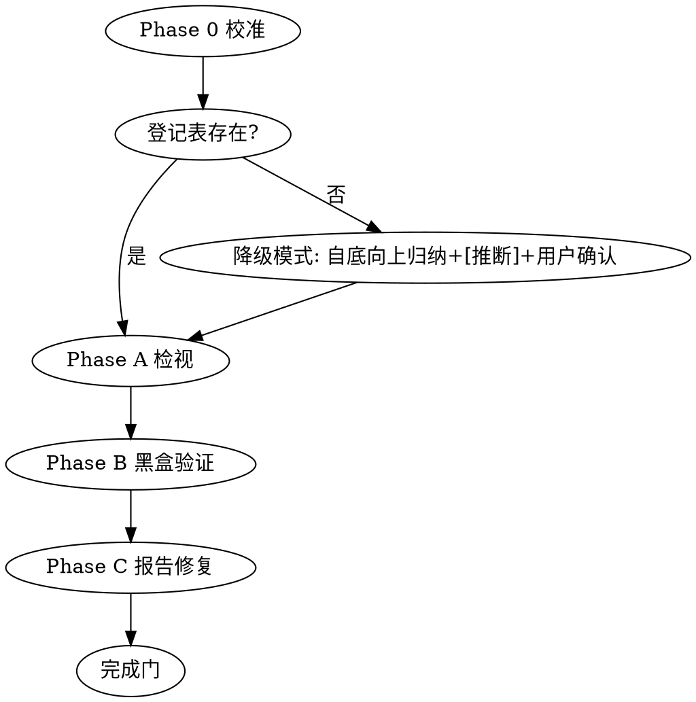

# 扩展性后哨:扩展性检视与黑盒验证

## Overview

双轨检视(确定性依赖规则 + LLM 语义回查/坏味道扫描)+ 黑盒验证(功能验收 + 变更模拟波及面度量)。

完成门(5 条全满足):登记表 100% 回查 | 依赖规则全绿 | 验收测试全绿 | 抽样变更模拟达标 | H 级发现全修复且无未处置 AMBIGUOUS。

## When to Use

- 实现完成、合并/PR 之前
- 用户要求扩展性检视、变更模拟、波及面度量
- 怀疑 AI 生成代码不好扩展

**When NOT:**
- 编码前的设计阶段(若装有 extensibility-design 则交给它)
- 设计文档与代码的一致性校验(职责不同的专项校验,非本 skill)

## Workflow

### Phase 0 校准

1. 识别栈、测试框架、测试命令
2. 定位 `<repo>/.extensibility/`;无登记表 → 降级模式:自底向上从代码归纳变化点(全部标 `[推断]`),请用户确认后重建登记表再继续

### Phase A 扩展性检视(双轨)

- **轨 1 确定性**:登记表存在未物化 RULE 规格先物化为可执行测试;然后运行全部依赖规则测试,违规即发现
- **轨 2 LLM 语义**:
  - 登记表回查:每个 T2 扩展点在代码中真实存在、位置正确(`file:line` 证据),且**采用了 ADR 声明的预设模式**(声明策略却写成 if-else 链 = H 级);`[自定义机制]` 单独复核
  - 坏味道扫描:按 `references/smells-catalog.md` 逐信号检测
- 分级:H = T2 缺失/名存实亡、模式偏离、shotgun surgery 实锤、依赖规则违规;M = 局部耦合、T3 变化点出现未登记扩散修改;L = 文档/命名;每条发现按 `templates/finding-record.md` 记录(证据链 + 对抗复核区)
- **H 级双代理对抗复核**:按 `references/adversarial-lite.md`;无子代理能力 → 单代理复核,报告标注"未交叉验证"

### Phase B 黑盒验证

- **B1 功能验收**:T1 变化点对应功能有验收测试;**变异抽查**——对核心逻辑做 1-2 处变异,测试必须变红再还原(防"永远绿"假测试);缺失则补写
- **B2 变更模拟**:按 `references/blast-radius-metrics.md` 抽样 top 2~3 个 T2,在独立 worktree 真实实施,度量四指标,判定达标;**默认回滚**,用户可选保留
- **B3 门禁固化**:修复后重跑依赖规则 + 验收测试;登记表条目更新状态 `已验证 YYYY-MM-DD`

### Phase C 报告与修复

- 修复 H/M 发现(改代码);发现登记表裁决本身有误(漏判/误判)→ 标记并**请示用户**后演进登记表
- 产出 `.extensibility/audit-reports/audit-NN.md`(`templates/audit-report.md`)

## Quick Reference

| 指标 | 达标线 |
|------|--------|
| 新增文件数 | 不限 |
| 修改既有文件数 | 0(或均在 ADR 迁移触发条件声明内) |
| 修改行数 | 记录用 |
| 既有测试破坏数 | 0 |

降级速查:无测试框架→静态回查+只统计波及面;无 git→临时目录副本;无依赖规则工具→LLM 检查+标注约束力降级;登记表缺失→降级模式重建。

## Common Mistakes

| 错误 | 纠正 |
|------|------|
| 测试通过就认为验证完成 | 完成门 5 条全满足 |
| 变更模拟只推演不实施 | 必须真实实施并度量四指标 |
| 直接修改登记表裁决 | 登记表是活文档,但演进须用户确认 |
| 把单元测试当正确性证据 | 变异抽查不过 = 测试不算数 |
| 检视止于"建议解耦" | 每条发现须有 file:line 证据与分级 |
