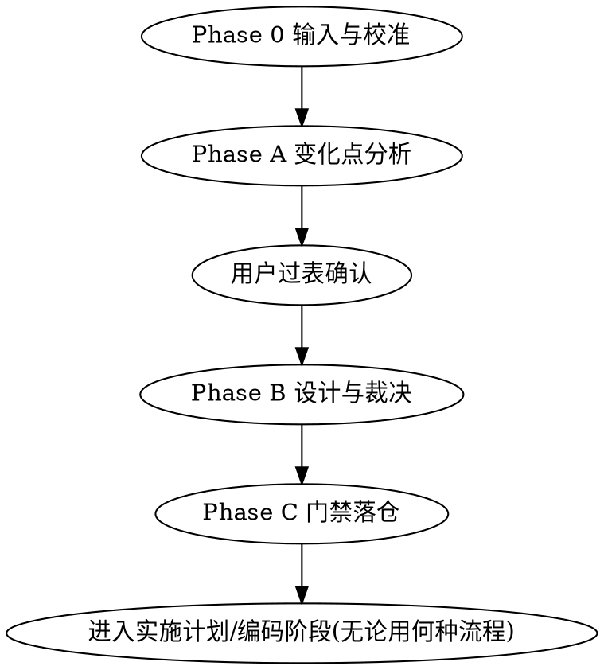

# 扩展性前哨:变化点分析与扩展性设计

## Overview

在编码前把"未来不好扩展"问题前移解决:枚举变化点 → YAGNI 裁决 → 从预设模式目录选用扩展机制 → 可执行门禁落仓。

核心度量:**扩展性 = 实施一个预判变更的波及面**(只新增、不修改为最优)。扩展性问题在编码前解决,成本最低。

## When to Use

- 需求/设计文档已存在,即将进入实施计划或编码
- 用户要求做扩展性设计、预留扩展点、变化点分析
- 新项目/新模块的架构设计

**When NOT:**
- 代码已写完需要检视(若装有 extensibility-audit 则交给它)
- 设计文档与代码的一致性校验(职责不同的专项校验,非本 skill)
- 纯 bug 修复、无新设计决策

## Workflow

### Phase 0 输入与校准

1. 定位需求/设计文档:任何来源——用户提供的文档、仓库内 docs(常见如 docs/specs/、docs/design/、`*-design.md`)、或用户口述要点
2. 识别技术栈、构建/测试命令、目录结构约定
3. 无文档 → 先引导用户完成需求设计,禁止臆测需求

### Phase A 变化点分析

1. 读 `references/change-taxonomy.md`,按 8 维度逐维度扫描,产出候选变化点(含依据:需求原文 / 领域常识 / `[推断]`)
2. 每条变化点评分:可能性 H/M/L、影响面 H/M/L
3. 分类库未覆盖的变化点照样记录,并写入登记表"新信号登记"区(Layer 2)
4. **一次性向用户过表**(多选问题交互),确认增删改
5. 按 `templates/change-register.md` 模板落盘 `<repo>/.extensibility/change-register.md`

### Phase B 扩展性设计与 YAGNI 裁决

裁决矩阵(**自上而下首个命中行生效**;先看影响面,再看可能性):

| 可能性 | 影响面 | 裁决 |
|-------|-------|------|
| H | H | T1 立即实现(直接进设计,不留扩展机制) |
| M | H | T2 预留扩展点 |
| H 或 M | M | T2 预留扩展点 |
| L | H 或 M | T3 仅记录(一句话理由,零设计投入) |
| 任意(含 H) | L | T3 仅记录 |

即影响面为 L 一律 T3;影响面为 H 且可能性为 H 才升 T1,可能性为 M 即 T2;影响面为 M 且可能性 ≥ M 即 T2;可能性为 L 为 T3。

1. 每个 T2 从 `references/extension-patterns.md` 预设模式目录选用机制:查维度→候选映射,**抽象成本最低优先**;目录不合身才允许 `[自定义机制]` + 理由(后哨将单独复核)
2. 成本上限:每个扩展点 ≤ 一层抽象 + 文档,超出即过度设计
3. 每个 T2 按 `templates/decision-record.md` 写轻量 ADR(决策/理由/代价/迁移触发条件)→ `<repo>/.extensibility/design-decisions.md`
4. 按 `templates/design-constraints.md` 产出编码约束段(可执行表述:允许什么/禁止什么)→ `<repo>/.extensibility/design-constraints.md`

### Phase C 门禁落仓

1. 目录结构已定 → 按 `references/fitness-rules-guide.md` 生成依赖规则测试,并入测试命令
2. 目录未定 → 结构化规则规格写入登记表(RULE-NN,路径占位),待物化为可执行测试(若装有 extensibility-audit 则由其物化)
3. 栈无适配工具 → AGENTS.md 自然语言约束段,登记表标注 `门禁:语言约束(降级)`
4. AGENTS.md 增补扩展性约束段:引用登记表路径,不复制内容

## Quick Reference

| 产物 | 位置 |
|------|------|
| 变化点登记表(CP-NN) | `<repo>/.extensibility/change-register.md` |
| 决策记录(ADR-NN) | `<repo>/.extensibility/design-decisions.md` |
| 编码约束(CON-NN) | `<repo>/.extensibility/design-constraints.md` |
| 依赖规则测试(RULE-NN) | 各栈惯例位置 / 登记表规格 |
| AGENTS.md 约束段 | `<repo>/AGENTS.md` |

## Common Mistakes

| 错误 | 纠正 |
|------|------|
| 为低概率变化设计机制 | L 可能性一律 T3,只记录 |
| 设计输出对扩展性零讨论、默认单一实现 | 每个变化点必须有显式裁决(T1/T2/T3);T2 须有机制与 ADR |
| 一个扩展点叠多层抽象 | ≤ 一层抽象 + 文档 |
| 自由发明扩展机制而不查目录 | 先查目录;不合身才 `[自定义机制]` 并留理由 |
| 门禁只写文档不落测试 | 有栈适配工具时必须生成可执行测试 |
| 把扩展性约束整段复制进 AGENTS.md | 引用登记表路径,不复制 |
| 替用户决定变化点取舍 | 过表确认是硬性步骤 |
